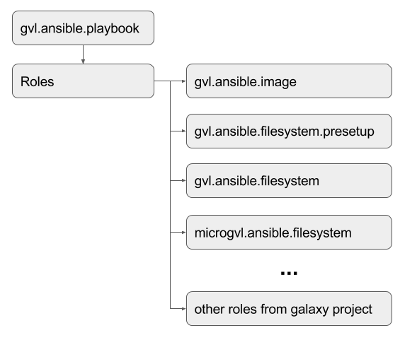

# microgvl.ansible.filesystem

The ansible playbook for the microbial gvl filesystem. It is an extension of the normal GVL filesystem ansible script. It is located at https://github.com/gvlproject/microgvl.ansible.filesystem

## Role

This playbook has been designed as a role under the **gvl.ansible.playbook**. Located at: https://github.com/gvlproject/gvl.ansible.playbook.

The exact relationship between the scripts is shown in the figure below.

*Figure 1: Relationship between gvl playbook and associated ansible roles*

The **microgvl.ansible.filesystem** role extends the **gvl.ansible.filesystem** role. It overrides several variables and adds some extra tasks.

The layout of the role is as follows:

* **microgvl.ansible.filesystem**

  * **defaults**

    * *main.yml* - file contains the global variables for the script. Also overrides several variables located in the corresponding location of the *gvl.ansible.filesystem* script.

  * **files**

    * *galaxy-app* - contains the overridden *welcome.html* file for the greeting page of Galaxy. (Overrides *gvl.ansible.filesystem*)

    * *scripts* - contains *shed_tool_list.yaml.mgvl* - list of tools to be installed into Galaxy.

    * *system-ansible.yml* - This script is to change the base image partition (root partition) post launch. It installs system packages, adds some directories and installs some extra R libraries. This is necessary as there is no way to alter the root partition of the base gvl image at filesystem build time.

  * **meta**

    * *main.yml* - Contains some meta data about the role including its dependencies, license etc.

  * **tasks** - the set of yaml files that are executed by ansible during the build process for this role.

    * *main.yml* - runs the micro_gvl_cmd_apps.yml script and then finally creates the fs acrhive.

    * *micro_gvl_cmd_apps.yml* - creates some directory structure and then runs the installation yml files.

    * *install_linuxbrew.yml* - Installs base linuxbrew and some of the required brew packages.

    * *install_nullarbor.yml* - Installs T. Seemanns nulalrbor pipeline and associated packages via linuxbrew and perl cpanm. It also downloads and sets up the kraken microbial identifier database.

    * *install_visualisers.yml* - Installs various genomics visualiser software such as Mauve, IGV, Artemis and Bandage.

    * *install_other_brew_tools.yml* - Installs other stand alone tools, mostly via brew. It adds some to the linuxbrew python via pip. It also installs a few R libraries to the system R.

  * **templates**

    * *copy_modules.j2* - template that creates a script to move various pathing files to */etc/profile.d* and to run the *system-ansible.yml* script. This script is run postlaunch of the individual instances and modifies the underlying system root partition to accommodate the changes necessary for the microbial GVL.

    * *linuxbrew-path.j2* - template for the linuxbrew environment paths to be copied into */etc/profile.d* of the instantiated microgvl.

    * *linuxbrew.j2* - template for the linuxbrew environment module for use on cloudman clusters.

    * *visualiser-paths.j2* - template for the environment paths for the installed visualiser software.
